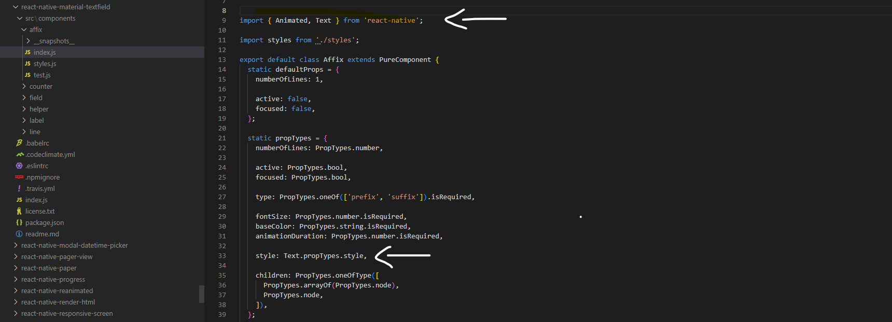

**Jaja Seller Android**

**1. installasi (bila tidak ada node modules)**

1. npm install
2. buka node modules cari react-native-material-textfield => src => components 
3. didalam components buka folder affix => masuk ke index.js
4. tambahkan import:
     - sebelum import { Animated, Text } from 'react-native';
     - sesudah import { Animated, Text } from 'react-native';
5. edit code:
     - sebelum style: Animated.Text.propTypes.style
     - sesudah style: Text.propTypes.style
6. gambar contoh sesudah 
7. save dan close folder affix
8. buka folder helper dan label
9. lakukan hal yang sama seperti nomer 4 dan 5
10. ini gambar contoh list folder yg harus di ganti [Screenshot](ascreenshoot.png)
11. save dan close semua folder dari node modules
12. jalankan command npx react-native run-android
# JajaSeller-Android
